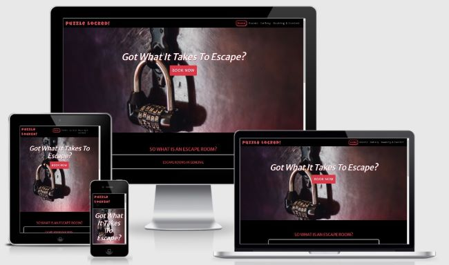

# Puzzle Locked! 

[Click here for live site](https://bradders81.github.io/ms1-escape-rooms/)

An escape room experience with a variety of different rooms on offer.  
___

## Reason for creation of Puzzle Locked!

I am studying the Full Stack Developer Diploma at the Code Institute and this site has been created for my Milestone 1 Project. I am tasked with building a responsive user centric website using HTML and CSS.  Any Java Script is provided via the Bootstrap CDN.  Puzzle Locked is a fictional venue.  
_____

## Description

Puzzle Locked! is an escape room venue based in Leeds, UK.

There are four different themed escape rooms to choose from.  The aim of the game is to work in teams of 2 to 6 people to solve puzzles, in order to obtain clues to ultimately escape from the room.  All rooms have a different theme and participants have 60 minutes to complete the game.

---
## User Stories

"I want a site that I can navigate easily on different devices"  
"I want to be able to make a booking online"  
"I want to be able to find contact details for the venue if I have a question" 
"I want to know if other people have enjoyed the experience"  

---
## UX 

### Strategy

**Owner:** 
* Wants to generate bookings.
* Create an online presence.
* Build a database of email addresses for marketing.
* Tell people about the escape rooms on offer.

**User:**
 * To be able to find information about the escape rooms on offer.
 * To be able to make a booking online.
 * Easy navigation of the website.
 * See a price list.
 * Find contact details for Puzzle Locked!.
 * To see other customer comments.

### Scope

The project will:
* Have a call to action (booking) button on the landing page.
* Describe the types of rooms available with a description.
* Have a gallery to see what an escape room looks like, which will grow over time.
* Mailing list
* Booking from

## Structure

As the popularity of escapes room in the UK continues to grow, so does the commercial competition.  The site is to be built using dark contrasting colours and images that try to give a feel of mystery, given that a sense of mystery is part of the alluring attraction of an escape room experience.

Each page will have the same the colour scheme and navigation layout to encourage intuitive learning from the user.  The call to action button will take the user direct to the booking page, which will be set on a background hero image.  This will help serve the site owner's objective of generating bookings, but will also assist returning users who are aware of the service on offer and want to be able to access the booking page quickly.

## Skeleton

[Click here for the sites wire frames](assets/docs/escape-room-wf.pdf)

The site will have four pages:  
* Landing page (Home) - with an about section and customer comments.
* Rooms - to show off what escape rooms are available.
* Gallery - place for the owner to show off images and for users to view.  
* Booking & Contact - to book experiences.
* Each page will have buttons in additions to the navbar to help navigate the site or make a booking.

## Surface

The main colours to be used in the site are red and black, with the odd exception.  Text was going to be white, but upon building the site I decided to use the light shade of grey provided by the Bootstrap navbar included in the site.  The shade of red that I have used for the section headers is from the Bootstrap btn-danger class, as I felt that this shade compliments the grey text nicely.  White text is used for the buttons on the site.

The main font family used is Merriweather Sans, sans-serif, with the exception of the logo 'Puzzle Locked!' in the navbar which uses the font family Luckiest Guy, cursive.

I did some online research into fonts and Merriweather Sans was one that was mentioned as been easy on the eye, both on large PC monitors and mobile.  The font size is fixed to 16px, in the event the browser used to view the site does not have 16px as the default font size.

I initially planned to have the content to sit on top of a background image or colour to scroll with the page.  However, the background images I finally settled on (red smoke) gives a better effect and UX with the background fixed.

The image selected for the hero image is an old combination lock, to be in keeping with the business name of Puzzle Locked.

### Mockup

---

## Features

The navbar will be fixed to the top of the viewport so that the user always has access to the navigation without scrolling. The nav links will act as page headings to save screen real estate.

The footer will have links to social media, as well as a model to join the mailing list.

### Home Page 

This is the landing page.  The user will be greeted by the background hero image, call out text (h1 header) and call to action button.  The hero image has been set so that it does not take up the entire viewport on most screen sizes. This leaves the section below visible to encourage the user to scroll down.

The next section provides a description of what an escape room is and how they work at Puzzle Locked!. The description is not to be overlong, so as to not lose the users attention or make the game sound over complicated.  Text will have a button/link to encourage the user go to the rooms page. 

The bottom section of the page will have customer comments. I did test doing this to see if it would work via a carousel instead of static images/text, but the Bootstrap Counsel did not give the style I wanted. 

### Rooms

This will include the name and a description of the escape rooms available along with a picture.  There will be a link/button on to take the user to the booking page.

### Gallery

Will contain images of the rooms and also customers taking part.  I did consider whether the images should be displayed using a carousel and this is something that I discussed with my mentor.  However, after doing some testing when building the page I decided to stick with the column layout from a UX stand point. As the gallery grows in size, clicking through a carousel is not as convenient as simply scrolling, so would not provide good UX.

### Booking

The page will provide the user with the ability book an escape room online.  It will also provide the user with a price list and the contact details. As creating a mailing list database is an objective of the site owner, the booking form will have an option for the user to join the mailing list at the time of booking, so a user making a booking does not need to complete a separate from to join the mailing list.  

### Future Features

Online payments - the ability for a user to be able to make payment at the time of booking.

Online version of an escape rooms - due to the COVID pandemic, people have been looking for more online forms of entertainment.

Online feedback section.  The site could also link to pages such as Trip Advisor.

----

## Technologies

* **HTML** - For the main structure of the site.
* **CSS** - For the styling of the site.
* [Bootstrap](https://https://getbootstrap.com/docs/4.5/getting-started/introduction/) - Used to provide the navbar and model and make the site responsive.
* [FontAwesome](https://fontawesome.com/) - Use to provide icons for social media links and contact details.
* [Google Fonts](https://fontawesome.com/) - Used to provide provide the fonts for the site.
* [Gitpod](https://www.gitpod.io/) - Within the Integrated Development Environment (IDE) used in this project.
    - Gitpod extensions used: Auto Close Tag; Bootstrap 4CDN Snippet for boilerplate and head; HTML Hint; Prettier; Color Picker; Indent-Rainbow; and Code Spell Checker.
* [Git](https://git-scm.com/) - version control technology used in ths project.
* [GitHub](http://github.com/) - Stores repositories and is updated via commits sent to it via Git. Also used to deploy the site to GitHub Pages
* [GitHub Pages](https://pages.github.com/) - Hosts the live site.
* [Google Chrome Developer Tools](https://developers.google.com/web/tools/chrome-devtools) - Used to debug, test the responsiveness of the site.  Also used to test some features before the code was put into page via Gitpod.
* [FreeFormatter.com](https://www.freeformatter.com/html-formatter.html) - Used at the end of the project to make sure the HTML code indents correctly and is easy to read.
* [Minify Code (CSS Beautifier)](http://minifycode.com/css-beautifier) - Used in Style.css to make sure the code is presented correctly and easy to read.
* [TinyJPG](https://tinypng.com/) - Used to resize images to reduce loading times and improve the sites performance.
* [balsamiq](http://https://balsamiq.com/wireframes/desktop)- Used to create wireframes
* [Am I Responsive](http://ami.responsivedesign.is/) - Used to create mockups of the site landing page on PC, tablet and mobile devices.
----

## Testing

[Click here for testing information](assets/docs/testing.md)

## Deployment

The site is created using Gitpod (IDE) and the site documentation is contained within a repository in GitHub.  The repository can be found [here](https://github.com/Bradders81/ms1-escape-rooms)

The files, documents were sent to GitHub from Gitpod, by using the Git software with the following commands

* git add <em>file(s) name</em>
* git commit -m "commit description"
* git push

The site is hosted in GitHub Pages and the following process can be used to deploy the project to a live site (which is the process I used)

1. Log into GitHub
1. From within the [repository](https://github.com/Bradders81/ms1-escape-rooms) click the settings (next to insights)
1. From within settings scroll down the page to 'GitHub Pages' section
1. Within that section select the branch to be deployed (master is recommended)
1. Click Save.
1. The site will then be deployed to git hub pages and you will be provided with a web address.

**Cloning the site**

1. From within the repository click on 'Code' button with the download icon.
1. A small menu will appear to give you various options.  One option is to copy the URL provided in this menu.
1. Within the Integrated Development Environment (IDE) that you are using, change the directory to the ULR you have just copied. 
1. For more options and details as to how to clone the site click [here](https://docs.github.com/en/free-pro-team@latest/github/using-git/which-remote-url-should-i-use)

---

## Credits

In the main I have used the skills have have learned from my studies at the Code Institute.  

The way in which the social media icons/links are set out in an unordered list in the footer is taken from what I learned in the 'Resume Project' as part of the course.  

They way in which the call to action button is positioned in center of the page(.button) is taken from what I learned in 'the Whiskey Drop' walk-through project, as part of the course.

The general structure of this README is taken from one suggested by Code Institute.

**Bootstrap**: Code snippets have been used for the navbar and the mailing list modal, which I have commented in the html documents. Bootstrap CSS classes have also been used throughout the site.

**Google Fonts**: the import at the to of style.css was copied from Google Fonts.

The code used for the sticky footer was taken from [CSS-Trick](https://css-tricks.com/couple-takes-sticky-footer/#there-is-flexbox), in an Article by Chris Coyier.  The article provides five ways to create a sticky footer.  I used the option headed 'There is a flex'

**Icons**: The social media icons in the footer and the icons in the contact details on Booking and Contact page are taken from Font Awesome and the CDN is contained within the head element on each page.

**Head Element boilerplate**:  This was created using the !BCDN extension in Gitpod

### **Images**

#### Home Page

[Hero Image](https://www.shutterstock.com/image-photo/vintage-combination-lock-quest-escape-room-1185939031) Obtained via Shutterstock, Created by Michal Durinik

[Comments 'Andy'](https://www.pexels.com/photo/man-wearing-black-zip-up-jacket-near-beach-smiling-at-the-photo-736716/) Obtained from Pexels, by Tim Savage

[Comments 'Amber'](https://www.pexels.com/photo/woman-wearing-black-eyeglasses-1239291/) Obtained from Pexels, by Daniel Xavier

[Comments 'Sarah'](https://unsplash.com/photos/ROJFuWCsfmA) Obtained from Upsplash, by Dan,  dan-ROJFuWCsfmA-unsplash

[Comments 'A2Z Recruitment](https://www.pexels.com/photo/group-of-people-in-dress-suits-776615/) Obtained from Pexels, by Marily Torres

#### Rooms Page

[bg-image-1](https://www.shutterstock.com/image-illustration/red-smoke-stage-studio-abstract-fog-1410379217) Obtained from Shutterstock, by getgg

[bg-image-2](https://www.shutterstock.com/image-illustration/red-smoke-stage-studio-abstract-fog-1359408029) Obtained from Shutterstock, by getgg

[VR Room](https://unsplash.com/photos/Ozz3tk1Jz4I) Obtained from unsplash, by Stephane Bernard

[Stop The Bomb](https://pixabay.com/photos/building-control-panel-controls-1853330/) Obtained from Pixabay, by Pexels

[Where are We?](https://unsplash.com/photos/ePli6L_npzg) Obtained from Unsplash, by Cabin Rugs

[Let Me Out!](https://unsplash.com/photos/3XvebFz_yhI) Obtained from Unsplash, by Ashim D'Silva

#### Gallery images

[3 People Solving Puzzle](https://www.shutterstock.com/image-photo/young-people-looking-bucket-search-conundrum-640243480) Obtained from Shutterstock, by Viacheslav Nikolaenko

[4 People playing escape room](https://www.shutterstock.com/image-photo/men-women-business-suits-solving-quests-1423520651) Obtained from Shutterstock, by Iakov Filimonov

[Basement Room 2](https://pixabay.com/photos/bunker-the-abandoned-boxes-digging-622510/) Obtained from Pixabay, by User 547877

[Basement Room 3](https://www.shutterstock.com/image-photo/escape-room-controlled-by-hiend-electronics-1067235680) Obtained from Shutterstock by May Lana

[Escape Room Red](https://unsplash.com/@zacharykeimig) Obtained from Unsplash, by Zachary Keimig

[People Playing Puzzle 1](https://www.shutterstock.com/image-photo/young-people-trying-solve-conundrum-get-640243435) Obtained from Shutterstock by Viacheslav Nikolaenko

[VR Remote](https://unsplash.com/@fifernando) Obtained from Unsplash by Fidel Fernando

[Space Station](https://pixabay.com/illustrations/explore-outer-space-sci-fi-fantasy-4255260/) Obtained from Pixabay, by prettysleepy1

---

## Acknowledgements

Thanks go to:

- My mentor, Ignatius Ukwuoma for his advice and feedback.
- The Code Institute Slack Community for their rapid response to any query I have had.
- The Code Institute Tutors for their assistance with any queries.
---

