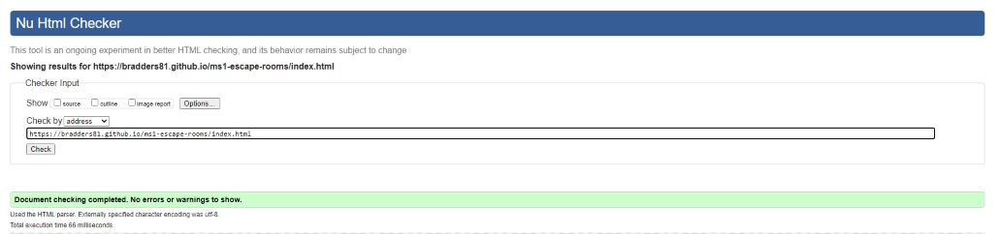
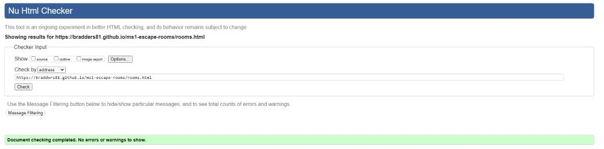
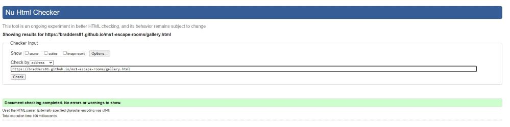
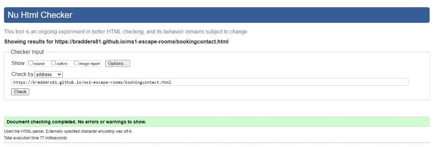
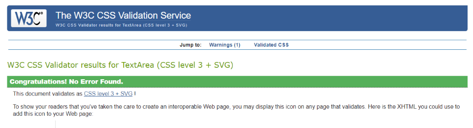

# Testing of Puzzle Locked Escape Rooms

The tests will be run to make sure buttons, links and the navbar works.  The site is responsive.  The user stories are dealt with, code passes the code validation checks.

**User Stories**  

   1. **I want a site that I can navigate easily on different devices**  
    The site is responsive and the navigation is consistent across all pages
    
    1. **I want to be able to make a booking online**  
    The site has a booking page and the are links/buttons at appropriate parts of the site to take the user to the booking page.

    1. **I want to be able to find contact details for the venue if I have a question**  
    Contact details (telephone number, email and address) are provided on the booking and contact page.  Also clicking on the e-mail address will open a link within users e-mail software.

    1. **I want to know if other people have enjoyed the experience**
    The bottom of the landing page (home) provides customer comments. 

**Forms**  - Please note, the form in the model and also the booking form do not yet have any backend technology because that is beyond the scope of this project for the stage of the course I am at.

1. Tested page logo takes user back to home page - pass
1. Tested navbar links work on all pages - pass
1. Tested Model works on all pages- pass   
1. Tested buttons and links work on all pages - pass
1. Tested site renders correctly at different screen sizes (mobile tablet and PC).  
    - Overflow of bg-image-1 and bg-image-2 goes beyond footer on PC if screen is zoomed out.  Fixed by adding a sticky footer.
    - E-mail address on the booking and contact page does not stay in container on PC. Fixed: included < br > in e-mail address.  
    - Call to action button drops below or partly below hero image on mobile phone devices when viewed in landscape orientation.  I have increased the height of the hero image so that the button either stays on the hero image, or sit neatly underneath on most screen sizes

1. Tested site on different browsers: Chrome, Firefox, Edge.  The site works fine on these browsers.  The home page and the gallery page does not render correctly on Internet Explorer.  I attempted to use vendor a vendor prefix -ms- but this did not cure the problem.  Having sought advice from a Code Institute Tutor, I was advised that it is not essential to test on Internet Explorer as it an old browser. 

1.Tested site on in Chrome DevTools in incognito mode - tests passed

1. Tested HMTL code on [Validator.w3](https://validator.w3.org/).  

    - Suggested that a heading is needed for article on index.html.  Added sub headings to article.
    - Warning: Needs heading to Gallery page.  My navbar acts as my heading on larger screen sizes and the page does have a heading for smaller screens, so I do not think this is needed. However, so my code passed the test I did add a heading which is visible on all screen sizes.  However, I felt that this was not in keeping with the rest of the site.  I therefore reverted back to a heading that is only visible on a smaller viewport when the navbar collapses.  So that my code passes the validator check I moved the heading inside the gallery section of the code, instead of being in its own section.  This is hindsight is more semantic.
    - had to correct some errors with the form and table tags/inputs on booking page.
    - Tests passed on all pages.  Click [here]() to see results.

 1. Tested CSS code on [W3C CSS Validation Service](https://jigsaw.w3.org/css-validator/#validate_by_input+with_options).
    -  Error: line 454 - Value Error: background-color: none is not a background-color.  Fixed by removing code, as it was not needed.
    - Test now passed click [here]() to see results.

  1. Tested code again on [W3C Markup Validation Service](https://validator.w3.org/#validate_by_uri)
     - Code now passes - had to correct some errors with the form and table tags/inputs on booking page.  
  
All tests now pass results are below

**HTML** 

  **Home Page**  
  

**Rooms Page**  

**Gallery**

**Booking & Contact Page**

**CSS Validation**

**CSS**

  

